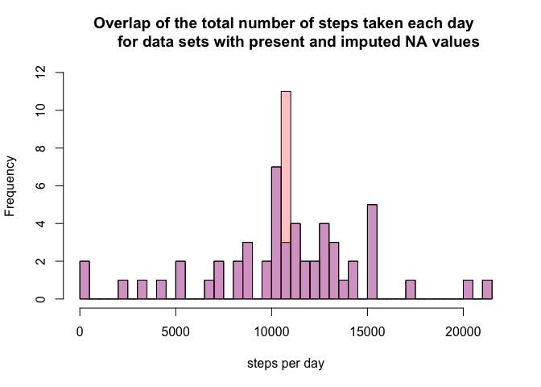

# Reproducible Research: Peer Assessment 1

# Reproducible Research: Peer Assessment 1

## Loading and preprocessing the data


```r
data <- read.csv("activity.csv")
head(data,n=5)
```

```
##   steps       date interval
## 1    NA 2012-10-01        0
## 2    NA 2012-10-01        5
## 3    NA 2012-10-01       10
## 4    NA 2012-10-01       15
## 5    NA 2012-10-01       20
```

## What is mean total number of steps taken per day?

Calculating the total number of steps taken per day. The result is a new data frame with two variables: "date", "stepsperday"


```r
library('plyr')
data1<-ddply(data, .(date),summarise, stepsperday=sum(steps))
head(data1,n=5)
```

```
##         date stepsperday
## 1 2012-10-01          NA
## 2 2012-10-02         126
## 3 2012-10-03       11352
## 4 2012-10-04       12116
## 5 2012-10-05       13294
```

Plotting a histogram of the total number of steps taken each day:


```r
hist(data1$stepsperday,breaks=50,
         main="The total number of steps taken each day",
         xlab="Steps per day")
```

 

Calculating the mean and median of the total number of steps taken per day.

```r
mean(data1$stepsperday,na.rm=TRUE)
```

```
## [1] 10766.19
```

```r
median(data1$stepsperday,na.rm=TRUE)
```

```
## [1] 10765
```

## What is the average daily activity pattern?

Reorganizing original data in order to make a series of plots:


```r
library('plyr')
data2<-ddply(data, .(interval),summarise, avalldays=mean(steps,na.rm=TRUE))
head(data2,n=5)
```

```
##   interval avalldays
## 1        0 1.7169811
## 2        5 0.3396226
## 3       10 0.1320755
## 4       15 0.1509434
## 5       20 0.0754717
```

Plotting:


```r
plot(data2$interval,data2$avalldays,
     main="Dayly activity pattern",
     xlab="intervals",
     ylab="Average number of steps",
     type="l"
     )
```

 

Finding out which 5-minute interval, on average across all the days in the dataset, contains the maximum number of steps:


```r
data2$interval[which.max(data2$avalldays)]
```

```
## [1] 835
```

## Imputing missing values

For calculating the number of NAs in the data set there is two ways.  
1. summary() function will show the number of NAs in its output:


```r
summary(data)
```

```
##      steps                date          interval     
##  Min.   :  0.00   2012-10-01:  288   Min.   :   0.0  
##  1st Qu.:  0.00   2012-10-02:  288   1st Qu.: 588.8  
##  Median :  0.00   2012-10-03:  288   Median :1177.5  
##  Mean   : 37.38   2012-10-04:  288   Mean   :1177.5  
##  3rd Qu.: 12.00   2012-10-05:  288   3rd Qu.:1766.2  
##  Max.   :806.00   2012-10-06:  288   Max.   :2355.0  
##  NA's   :2304     (Other)   :15840
```

2. using logical is.na() function:


```r
sum(is.na(data))
```

```
## [1] 2304
```

Both methods give the number of NAs is equal to 2304.

For imputing the NA values I've chosen to take the number of steps for each time interval averaged through all the days of observation (calculated above a the part researching daily activity pattern and stored as 'avalldays' column in 'data2' data frame). Creating a vector "imp" containing substitution values:


```r
imp<-rep(data2$avalldays,length(data$steps)/length(data2$avalldays))
data3<-data
for(i in 1:length(data3$steps)) {
        if(is.na(data3$steps)[i]==TRUE) {
                data3$steps[i]<-imp[i]
        }
}
sum(is.na(data)) ##cheking the number of NAs in initial data frame (should give "2304")
```

```
## [1] 2304
```

```r
sum(is.na(data3)) ##cheking the number of NAs in the new data frame (should give "0")
```

```
## [1] 0
```

For the new data frame: calculating the total number of steps taken per day, plotting a histogram
of the total number of steps taken each day, plotting a histogram of the total number of steps taken each day,
calculating the mean and median of the total number of steps taken per day.


```r
library('plyr')
data3sum<-ddply(data3, .(date),summarise, stepsperday=sum(steps))
head(data3sum,n=5)
```

```
##         date stepsperday
## 1 2012-10-01    10766.19
## 2 2012-10-02      126.00
## 3 2012-10-03    11352.00
## 4 2012-10-04    12116.00
## 5 2012-10-05    13294.00
```

```r
hist(data3sum$stepsperday,breaks=50,
     main="The total number of steps taken each day (imputed NAs)",
     xlab="Steps per day"
     )
```

 

Plotting the overlapping histograms for two data sets: the original one and the one with imputed missing values:


```r
p1 <- hist(data1$stepsperday,breaks=50)
```

```r
p2 <- hist(data3sum$stepsperday,breaks=50)
```

```r
plot( p1, col=rgb(0,0,1,1/4),ylim=c(0,12),
      xlab="steps per day",
      main="Overlap of the total number of steps taken each day 
      for data sets with present and imputed NA values")
plot( p2, col=rgb(1,0,0,1/4),ylim=c(0,12), add=T)
```

 


```r
mean(data3sum$stepsperday)
```

```
## [1] 10766.19
```

```r
median(data3sum$stepsperday)
```

```
## [1] 10766.19
```

As it can be seen above our strategy did not change the mean number of steps taken per day, although it did change the median which is now equal to mean.

## Are there differences in activity patterns between weekdays and weekends?

Creating a new factor variable 'weekpart' in a 'data3' data frame (the one with imputed NAs):


```r
data3$date<-as.Date(data3$date)
weekdayslist <- c('Monday','Tuesday','Wednesday','Thursday','Friday')
data3$weekpart<-factor((weekdays(data3$date) %in% weekdayslist),
                       levels=c(FALSE, TRUE),
                       labels=c('weekend','weekday')
                       )
```

Summarizing data (finding average amount of steps for each interval for different levels of 'weekpart' factor: weekend, weekday) and plotting:


```r
data4<-ddply(data3, .(interval,weekpart),summarise, aver=mean(steps))
library('ggplot2')
g<-ggplot(data4, aes(interval, aver))
g+geom_line()+facet_wrap(~weekpart)+xlab("Interval")+ylab('Average number of steps')
```

 
